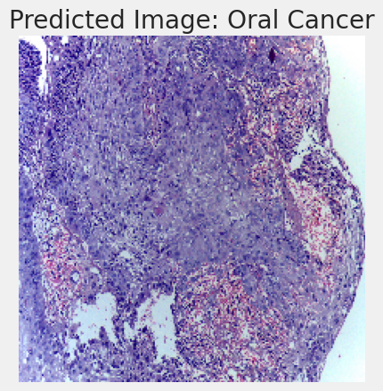
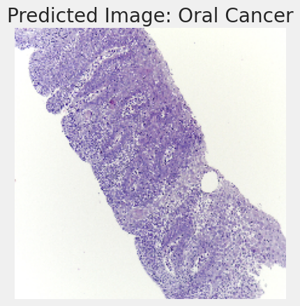
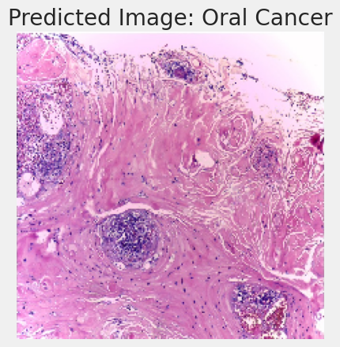
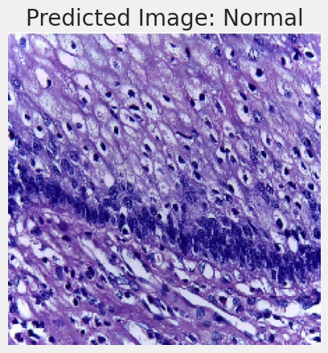
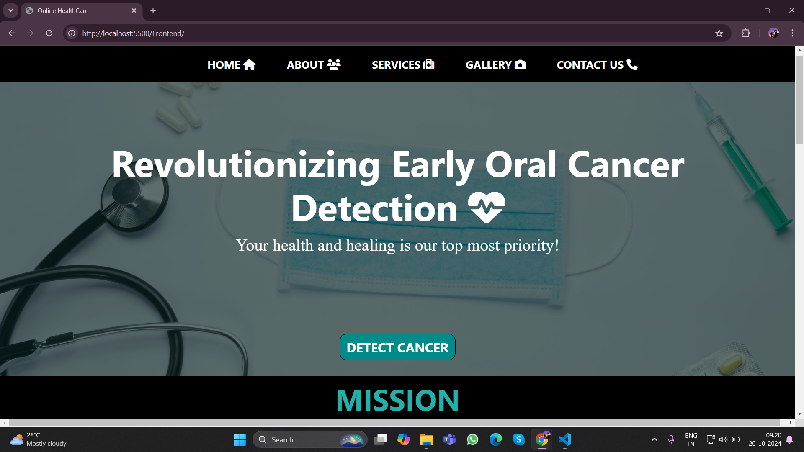

# Oral Cancer Detection using EfficientNet and Transformers

This project focuses on detecting oral cancer (OSCC) from histopathological images using a hybrid model built on **EfficientNetB3** and **Transformers**. The model classifies images into two categories: **Normal** and **OSCC (Oral Squamous Cell Carcinoma)** with high accuracy.

## Project Overview

- **Goal**: Early detection of oral cancer using deep learning models to assist in medical diagnosis.
- **Model Architecture**: Utilizes **EfficientNetB3** as the backbone for feature extraction, with a custom **Transformer Block** added for better contextual understanding.
- **Accuracy**: Achieved 97% accuracy on the validation and test datasets.

## Dataset

The dataset consists of histopathological images, divided into two classes:
- **Normal**
- **Oral Squamous Cell Carcinoma (OSCC)**

Images were preprocessed and augmented to improve generalization and robustness.

## Model Architecture

The model uses:
1. **EfficientNetB3** pre-trained on ImageNet for feature extraction.
2. A custom **Transformer Block** for enhanced attention and context in the image features.
3. A classification head with two outputs (Normal, OSCC).

### Data Augmentation
We applied the following data augmentation techniques:
- Horizontal Flip
- Rotation
- Resizing to (224, 224)

### Training
- Optimizer: **Adamax**
- Loss Function: **Categorical Cross-Entropy**
- Learning Rate: `1e-3` with **ReduceLROnPlateau** for adaptive learning rate.
- Early stopping and model checkpointing were used to prevent overfitting.

## Installation

1. Clone the repository:
   ```bash
   git clone https://github.com/your-username/oral-cancer-detection.git
   cd oral-cancer-detection

## Output 

### From Testing Dataset

```
Actual Class : Oral Cancer
Predicted Class : Oral Cancer
```
### From Training Dataset

```
Actual Class : Oral Cancer
Predicted Class : Oral Cancer
```
### New Images for Prediction

```
Actual Class : Oral Cancer
Predicted Class : Oral Cancer
```

```
Actual Class : Normal
Predicted Class : Normal
```
## Frontend integration :
